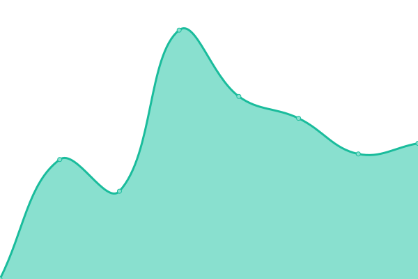
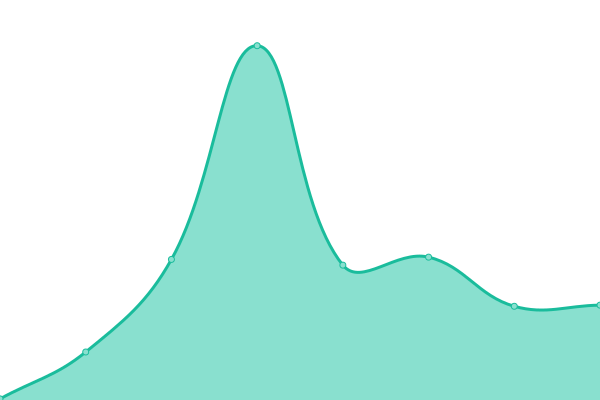
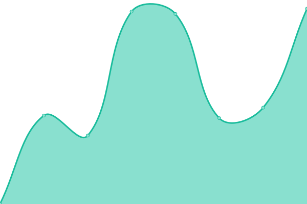

# [📈 Live Status](https://mohhasbias.github.io/blog-pulse): <!--live status--> **🟧 Partial outage**

This repository contains the open-source uptime monitor and status page for [Moh Hasbi Assidiqi](http://mohhasbias.github.io), powered by [Upptime](https://github.com/upptime/upptime).

With [Upptime](https://upptime.js.org), you can get your own unlimited and free uptime monitor and status page, powered entirely by a GitHub repository. We use [Issues](https://github.com/mohhasbias/blog-pulse/issues) as incident reports, [Actions](https://github.com/mohhasbias/blog-pulse/actions) as uptime monitors, and [Pages](https://mohhasbias.github.io/blog-pulse) for the status page.

<!--start: status pages-->
<!-- This summary is generated by Upptime (https://github.com/upptime/upptime) -->
<!-- Do not edit this manually, your changes will be overwritten -->
<!-- prettier-ignore -->
| URL | Status | History | Response Time | Uptime |
| --- | ------ | ------- | ------------- | ------ |
|  [Lecturer Page](https://hasbi.lecturer.pens.ac.id) | 🟩 Up | [lecturer-page.yml](https://github.com/mohhasbias/blog-pulse/commits/HEAD/history/lecturer-page.yml) | 

 1497ms
     
 | 

<a href="https://mohhasbias.github.io/blog-pulse/history/lecturer-page">100.00%</a>
    

|  [Blog](https://mohhasbias.github.io) | 🟩 Up | [blog.yml](https://github.com/mohhasbias/blog-pulse/commits/HEAD/history/blog.yml) | 

 95ms
     
 | 

<a href="https://mohhasbias.github.io/blog-pulse/history/blog">100.00%</a>
    

|  [Siniar PENS](https://siniar.pens.ac.id) | 🟥 Down | [siniar-pens.yml](https://github.com/mohhasbias/blog-pulse/commits/HEAD/history/siniar-pens.yml) | 

 2058ms
     
 | 

<a href="https://mohhasbias.github.io/blog-pulse/history/siniar-pens">90.81%</a>
    

<!--end: status pages-->

[**Visit our status website →**](https://mohhasbias.github.io/blog-pulse)

## 📄 License

- Powered by: [Upptime](https://github.com/upptime/upptime)
- Code: [MIT](./LICENSE) © [Anand Chowdhary](https://anandchowdhary.com), supported by [Pabio](https://pabio.com)
- Data in the `./history` directory: [Open Database License](https://opendatacommons.org/licenses/odbl/1-0/)
